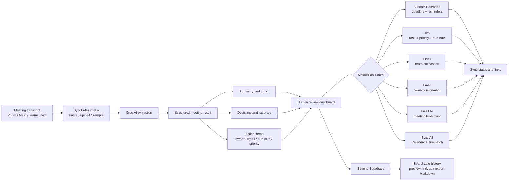

# SyncPulse

## AI meeting decisions and action automation

SyncPulse turns an unstructured meeting transcript into a reviewable, reusable work plan. It extracts the important outcomes, lets a person verify them, and then sends each action to the system where work already happens.

**Transcript in -> structured decisions and tasks -> human review -> automated work dispatch**

Use it after a Zoom, Google Meet, Teams, or other meeting to answer:

- What was decided?
- Who owns each follow-up?
- When is it due?
- Which tasks should become calendar events, Jira issues, Slack updates, or emails?

## What problem does it solve?

Meeting notes often become a second manual job. Someone has to read the transcript, find decisions, copy tasks into Jira, create reminders, and notify the team.

SyncPulse gives that workflow one place:

1. Paste, upload, or select a sample transcript.
2. Ask Groq AI to extract a summary, topics, decisions, owners, deadlines, priorities, and source quotes.
3. Review and edit the extracted results before anything is dispatched.
4. Send approved action items to the tools your team uses.
5. Save the meeting and search it later.

## Features

### 1. Flexible transcript intake

- Paste and edit raw transcript text.
- Upload `.txt`, `.vtt`, or `.srt` files.
- Clean common WebVTT timestamps and numbering during upload.
- Start quickly with built-in sample meetings.
- See word count and estimated reading time before analysis.

### 2. AI extraction into useful work items

The AI processing route converts a transcript into structured data:

- Executive summary
- Key topics
- Agreed decisions
- Decision categories and rationale
- Action items
- Owner names and email addresses
- Deadlines
- High, Medium, or Low priority
- Source quotes for traceability

The source quote is important: reviewers can compare an extracted item with the words that produced it instead of accepting an unexplained AI result.

### 3. Human-in-the-loop review

AI prepares the work; the reviewer remains in control.

- Edit decisions, rationale, categories, and statuses.
- Add or delete decisions manually.
- Edit task descriptions, owners, emails, deadlines, priorities, and categories.
- Add or delete action items manually.
- Expand source quotes while reviewing.
- Filter action items by all, pending, synced, or high priority.

### 4. One action item, several destinations

Each action item can be dispatched independently:

| Destination | Automation | Result |
| --- | --- | --- |
| Google Calendar | Create a deadline event with description, reminder, and optional attendee | A live Calendar event when OAuth is available, or a pre-filled Calendar link |
| Jira | Create a Task with summary, description, priority, project, and due date | A Jira issue key and link |
| Slack | Post a formatted notification with task, owner, deadline, priority, and category | A team update in the configured channel |
| Email | Send an assignment message to the task owner | A direct notification with task details and source context |
| Email All | Broadcast meeting minutes to selected recipients | A reviewable meeting summary and task breakdown |

Every action records its sync state, destination details, and timestamp so the reviewer can see what has already been sent.

### 5. Bulk follow-up automation

Use **Sync All** when a meeting produces several follow-ups. SyncPulse processes unsynced action items for Google Calendar and Jira, while individual Slack and email controls remain available when a notification needs more judgment.

### 6. Searchable meeting archive

Save reviewed meetings to Supabase and return to them later. The history view supports:

- Keyword search across titles, summaries, original transcripts, decisions, owners, and action items.
- Category filtering.
- Quick preview of meeting outcomes.
- Loading a saved meeting back into the reviewer.
- Deleting an archived meeting.
- Markdown export of meeting minutes.

## How to automate a recurring workflow

### Example: weekly product meeting

1. Open SyncPulse after the meeting.
2. Upload the transcript exported from your meeting platform.
3. Run **Extract Decisions & Action Items**.
4. Verify owners and add missing email addresses.
5. Edit any task that needs clarification.
6. Click Jira on engineering work that needs tracking.
7. Click Calendar for deadlines that require reminders.
8. Click Slack to notify the delivery channel.
9. Click Email All to send the final minutes to attendees.
10. Save the meeting for future search and audit context.

The reusable pattern is simple: **one transcript becomes many coordinated updates without retyping the same task into several systems**.

### Other useful workflows

- **Sprint planning:** create Jira tasks from agreed engineering work and calendar reminders for deadlines.
- **Customer or vendor calls:** save decisions, email owners, and preserve source quotes for follow-up.
- **Incident reviews:** turn remediation items into Jira issues and post a concise Slack handoff.
- **Project launches:** broadcast minutes, assign owners, and create deadline events in one review session.
- **Security reviews:** preserve an archive of decisions and action ownership for later audit or status checks.

## Visual workflow

The diagram below is intentionally split into readable stages. In GitHub, use the diagram's zoom controls or open the raw README if your Markdown viewer renders Mermaid at a small size.



### The same workflow in plain text

```text
Transcript
   |
   v
Paste, upload, or choose sample
   |
   v
Groq AI extracts summary, decisions, and action items
   |
   v
Review and edit results
   |
   +--> Calendar deadline
   +--> Jira issue
   +--> Slack notification
   +--> Owner email
   +--> Email All broadcast
   +--> Sync All batch
   |
   v
Save meeting -> search, reload, preview, or export Markdown
```

## Integration setup

Open **Settings** in the app to configure integrations. Configuration is stored locally in the active browser session.

### Groq AI

Provide a Groq API key in Settings or set `GROQ_API_KEY` in the server environment. Without a valid key, transcript extraction cannot run.

### Google Calendar and Gmail

Sign in with Google and grant the required access. Calendar uses the OAuth access token when available. If a live Calendar request is not available, the app generates a pre-filled Google Calendar event link instead.

### Jira

Configure:

- Jira domain, such as `https://company.atlassian.net`
- Jira email
- Jira API token
- Default project key

When valid Jira credentials are available, SyncPulse creates a real Jira Task. Without them, the app returns a simulated issue result so the review flow can still be demonstrated locally.

### Slack

Configure an Incoming Webhook URL and a channel. With a webhook, SyncPulse posts the formatted action item to Slack. Without one, the app returns a simulated dispatch result for local testing.

### Supabase

Supabase stores saved meetings and the searchable archive. Configure the Supabase variables before using persistent history.

## Getting started

### Requirements

- Node.js 18.18 or newer
- npm, pnpm, or yarn
- A Groq API key for live transcript extraction
- Optional: Google OAuth, Jira, Slack, and Supabase credentials

### Install

```bash
git clone https://github.com/SAHA-INDRANIL707/aws-challenge-PS3.git meeting-tracker
cd meeting-tracker
npm install
```

### Configure environment variables

Copy `.env.example` to `.env.local` and fill in the values you need:

```bash
cp .env.example .env.local
```

Common variables include:

```env
AUTH_SECRET="your-32-character-secret-key-here"
NEXTAUTH_URL="http://localhost:3000"
GROQ_API_KEY="gsk_your_groq_api_key_here"

NEXT_PUBLIC_SUPABASE_URL="https://your-project.supabase.co"
NEXT_PUBLIC_SUPABASE_ANON_KEY="your-anon-key"
SUPABASE_SERVICE_ROLE_KEY="your-service-role-key"

JIRA_HOST="https://your-domain.atlassian.net"
JIRA_EMAIL="your-email@company.com"
JIRA_API_TOKEN="your-atlassian-api-token"
SLACK_WEBHOOK_URL="https://hooks.slack.com/services/..."
```

Never commit `.env.local` or real API keys.

### Run the app

```bash
npm run dev
```

Open [http://localhost:3000](http://localhost:3000), sign in with Google, and process a sample transcript or your own meeting notes.

### Production checks

```bash
npm run lint
npm run build
```

## Project structure

```text
meeting-tracker/
├── app/
│   ├── api/
│   │   ├── actions/              # Calendar, email, Jira, and Slack dispatchers
│   │   ├── auth/                 # NextAuth route handler
│   │   ├── meetings/             # Meeting archive API
│   │   └── process-transcript/   # Groq extraction API
│   ├── globals.css               # Application design tokens and styles
│   ├── layout.tsx                # Root layout and providers
│   └── page.tsx                  # Main workflow and application state
├── components/
│   ├── TranscriptInputSection.tsx # Paste, upload, and sample intake
│   ├── ReviewDashboard.tsx        # Review, edit, sync, save, and export
│   ├── MeetingCarousel.tsx        # Summary and insight views
│   ├── SearchableHistory.tsx      # Archive search and previews
│   ├── IntegrationsModal.tsx      # Integration settings
│   └── EmailAllModal.tsx          # Meeting broadcast workflow
├── lib/
│   ├── groq.ts                   # AI extraction client and schema
│   ├── sampleData.ts              # Demo transcript presets
│   ├── supabase.ts                # Supabase access
│   ├── types.ts                  # Shared meeting and integration types
│   └── utils.ts                   # Formatting helpers
├── scripts/                      # Manual API and connection checks
├── supabase_schema.sql            # Database schema
└── .env.example                  # Safe environment variable template
```

## Safety and operating notes

- Review extracted owners, deadlines, and priorities before dispatching.
- Add a valid owner email before sending an individual assignment.
- Treat API keys and OAuth credentials as secrets.
- The Jira and Slack simulated responses are useful for demos, but they are not proof that an external update was delivered.
- Saved meeting content may contain sensitive business information; secure the Supabase project appropriately.

## License

This project is open source and available under the MIT License.
