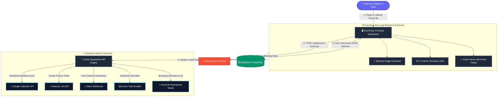

# ⚡ SyncPulse — AI Meeting Decision & Action Tracker

> **Turn messy, unstructured meeting transcripts into verified decisions and instant enterprise actions across Calendar, Jira, Slack, and Email in seconds.**

[](https://nextjs.org/)
[](https://react.dev/)
[](https://groq.com/)
[](https://supabase.com/)
[](https://tailwindcss.com/)
[](https://www.typescriptlang.org/)

---

## 🎯 What Does SyncPulse Do?

In modern teams, hours are lost every week reading through messy Zoom, Teams, or Google Meet transcripts trying to figure out:
- *What did we actually decide?*
- *Who is responsible for what?*
- *When is it due?*
- *Did anyone actually create the Jira ticket or send the calendar invite?*

**SyncPulse eliminates this post-meeting fatigue.** Simply paste or upload any raw transcript (`.txt`, `.vtt`, or text dump), and SyncPulse's high-speed **Groq Qwen AI** instantly extracts:
1. **Executive Meeting Minutes & Key Topics**
2. **Agreed Decisions** (with context and rationale)
3. **Action Items** (assigned to owners with due dates & priorities)

From there, you don't just stare at a static summary — **you execute directly from the dashboard** with 1-click dispatchers to **Google Calendar, Jira, Slack, and Email**.

---

## 🏗️ Visual Architecture & Workflow

Here is how SyncPulse seamlessly routes meeting discussions into live enterprise tools:



---

## ✨ Core Features & Usability

### 1. ⚡ Ultra-Fast Groq Qwen AI Extraction
- Powered by Groq's high-speed inference engine using **Qwen models** (`qwen/qwen3-32b` & `qwen/qwen3.8-27b`).
- Extracts crisp summaries, structured decisions, and actionable tasks with zero hallucination via strict JSON schema enforcement.

### 2. 🎡 Stacked Meeting Insight Carousel
- A responsive, stacked card slider at the top of your review zone.
- Easily toggle between **5 distinct slides** using left/right arrows or dot indicators:
  - **Slide 1 — Meeting Minutes:** Executive summary, date, and metrics breakdown.
  - **Slide 2 — Agreed Decisions:** Numbered list of agreements with rationale.
  - **Slide 3 — Action Items:** Priority breakdown (High/Medium/Low) + task list.
  - **Slide 4 — Key Topics:** Visual badges and topic frequency distribution.
  - **Slide 5 — Attendees Roster:** Detected participants and email status.

### 3. 👥 Clear Owner Email Input & Verification
- No more guessing how tasks get emailed. Every action item row includes a **highlighted, real-time validated email input box**:
  - Automatically flags missing emails with amber indicators.
  - Validates addresses with a green checkmark (`✓`) as you type.
  - Keeps owners tied to their tasks for both individual alerts and bulk broadcasts.

### 4. 🚀 Universal 1-Click Action Dispatchers
SyncPulse connects directly to the tools your team already uses:

| Tool | Action | What Happens |
| :--- | :--- | :--- |
| **✉️ Email All** | **Broadcast Minutes** | Opens a modal to review/add recipient emails and sends a responsive HTML email containing executive summary + personalized task breakdown. |
| **📧 Direct Email** | **Task Assignment** | Sends an individual email directly to the task owner with due date, priority, and original context quote. |
| **📅 Google Calendar** | **Schedule Due Date** | Creates an official calendar deadline event with description and task owner invite. |
| **🎯 Atlassian Jira** | **Create Issue** | Generates a project task in Jira Cloud with priority mapping and links back directly to the issue. |
| **💬 Slack** | **Post Update** | Dispatches a formatted Slack block-kit message directly to your designated team channel. |
| **✨ Sync All** | **Bulk Dispatch** | Iterates through all unsynced tasks and provisions them across Calendar & Jira with one click + celebratory confetti! |
| **💾 Save & Export** | **Archive & Markdown** | Saves full state to Supabase PostgreSQL and downloads complete meeting minutes in Markdown format. |

---

## 🛠️ Tech Stack & Architecture

- **Framework:** [Next.js 15 (App Router)](https://nextjs.org/)
- **UI Library:** [React 19](https://react.dev/), [Tailwind CSS](https://tailwindcss.com/), [Lucide React](https://lucide.dev/)
- **Design System:** Custom token-based dark theme with high contrast typography (Inter)
- **AI Engine:** [Groq Cloud SDK](https://console.groq.com/) using `qwen/qwen3-32b`
- **Database & Storage:** [Supabase PostgreSQL](https://supabase.com/) with schema migrations
- **Authentication:** [NextAuth.js (Auth.js)](https://authjs.dev/) with Google OAuth & Instant Demo Mode
- **APIs & Webhooks:**
  - Google Calendar REST API v3
  - Nodemailer / Resend / Google Mail Dispatcher
  - Atlassian Jira Cloud REST API v3
  - Slack Incoming Webhooks

---

## 🚀 Getting Started & How to Run

### 1. Prerequisites
- **Node.js** (v18.18 or higher recommended)
- **npm**, **pnpm**, or **yarn**
- Free **Groq API Key** from [console.groq.com](https://console.groq.com/keys)

### 2. Clone the Repository
```bash
git clone https://github.com/your-username/meeting-tracker.git
cd meeting-tracker
```

### 3. Install Dependencies
```bash
npm install
```

### 4. Configure Environment Variables
Create a `.env.local` file in the root directory (you can copy `.env.example`):

```bash
cp .env.example .env.local
```

Fill in your configuration:
```env
# NextAuth Configuration
AUTH_SECRET="your-32-character-secret-key-here"
NEXTAUTH_URL="http://localhost:3000"

# Groq AI Inference Key (Required for AI extraction)
GROQ_API_KEY="gsk_your_groq_api_key_here"

# Supabase PostgreSQL (Optional — App runs in fallback mode without it)
NEXT_PUBLIC_SUPABASE_URL="https://your-project.supabase.co"
NEXT_PUBLIC_SUPABASE_ANON_KEY="your-anon-key"
SUPABASE_SERVICE_ROLE_KEY="your-service-role-key"

# Integrations (Can also be configured inside Settings in the UI)
JIRA_HOST="https://your-domain.atlassian.net"
JIRA_EMAIL="your-email@company.com"
JIRA_API_TOKEN="your-atlassian-api-token"
SLACK_WEBHOOK_URL="https://hooks.slack.com/services/..."
```

> **Note:** If you don't have Jira, Slack, or Supabase set up right away, **don't worry!** SyncPulse includes graceful simulated fallbacks and UI settings modals so you can test all flows immediately.

### 5. Run the Development Server
```bash
npm run dev
```

Open [http://localhost:3000](http://localhost:3000) in your browser.

---

## 🧪 How to Test It in 60 Seconds

1. **Sign In**: Click **"Continue as Guest (Demo Mode)"** or connect your Google account.
2. **Load a Sample Transcript**: Click any of the pre-loaded sample transcripts (e.g. *Sprint Planning*, *Product Launch*, *Security Review*).
3. **Analyze**: Click the primary button **"Extract Decisions & Action Items"**.
4. **Explore the Carousel**: Flip through the top stacked cards to see your executive minutes, statistics, and decision summaries.
5. **Add Emails & Dispatch**:
   - Notice the highlighted email box under each action item. Add your email address.
   - Click **"Email All"** on the toolbar to preview and broadcast meeting notes to all attendees.
   - Click **"Add to Calendar"**, **"Jira"**, or **"Post to Slack"** to watch the status update in real time.
6. **Save or Export**: Click **"Export"** to download the clean Markdown minutes or **"Save"** to store to your archive.

---

## 📂 Project Structure

```text
meeting-tracker/
├── app/
│   ├── api/
│   │   ├── actions/
│   │   │   ├── calendar/      # Google Calendar event creation
│   │   │   ├── email/         # Individual task assignment emails
│   │   │   ├── email-all/     # Broadcast meeting summary to all participants
│   │   │   ├── jira/          # Atlassian Jira issue creation
│   │   │   └── slack/         # Slack channel webhook dispatcher
│   │   ├── auth/              # NextAuth route handlers
│   │   ├── meetings/          # Meeting CRUD & database synchronization
│   │   └── process-transcript/# Groq Qwen AI extraction API
│   ├── globals.css            # Design tokens, surface tiers, typography
│   ├── layout.tsx             # Root layout with AuthProvider & metadata
│   └── page.tsx               # Main application controller & state
├── components/
│   ├── EmailAllModal.tsx      # Recipient review & broadcast modal
│   ├── MeetingCarousel.tsx    # Stacked 5-slide interactive insight carousel
│   ├── Navbar.tsx             # Navigation header, user profile & tabs
│   ├── ReviewDashboard.tsx    # Decisions grid & actionable tasks list
│   ├── SettingsModal.tsx      # In-app integration key configuration
│   └── TranscriptInputSection.tsx # Ingestion panel with sample presets
├── lib/
│   ├── groq.ts                # Groq Cloud AI client with Qwen models
│   ├── supabase.ts            # Supabase database client & schema setup
│   ├── types.ts               # Shared TypeScript models (Meeting, Decision, ActionItem)
│   └── utils.ts               # Formatting, date utilities & helpers
└── README.md
```

---

## 📄 License
This project is open-source and available under the [MIT License](LICENSE).
