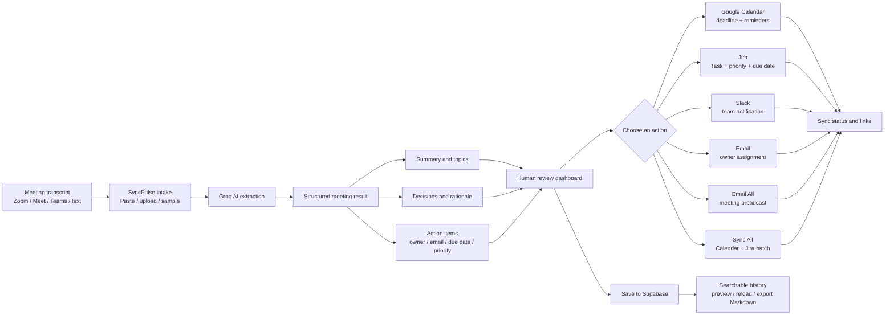

<div align="center">

# SyncPulse

### Turn meeting conversations into coordinated work

**AI-assisted meeting intelligence with a human review step and one-click delivery to the tools your team already uses.**

<p>
   
   
   
   
</p>

<p>
   <a href="#why-syncpulse">Why SyncPulse</a> ·
   <a href="#features">Features</a> ·
   <a href="#how-to-automate-a-recurring-workflow">Automation playbook</a> ·
   <a href="#getting-started">Get started</a>
</p>

</div>

<blockquote>
   <strong>Transcript in.</strong> Structured outcomes out.<br />
   Review decisions, confirm owners, and dispatch every follow-up from one workspace.
</blockquote>

## Why SyncPulse?

Meeting notes should not become a second manual job. SyncPulse turns the part of the meeting that usually disappears into a repeatable operating loop:

<table>
   <tr>
      <td align="center" width="20%"><strong>01</strong><br />Capture</td>
      <td align="center" width="20%"><strong>02</strong><br />Understand</td>
      <td align="center" width="20%"><strong>03</strong><br />Review</td>
      <td align="center" width="20%"><strong>04</strong><br />Dispatch</td>
      <td align="center" width="20%"><strong>05</strong><br />Remember</td>
   </tr>
   <tr>
      <td align="center">Paste or upload the transcript</td>
      <td align="center">Extract decisions and tasks with AI</td>
      <td align="center">Correct the details before sending</td>
      <td align="center">Push work to Calendar, Jira, Slack, or Email</td>
      <td align="center">Search the saved meeting later</td>
   </tr>
</table>

## Features

<table>
   <tr>
      <td width="50%" valign="top">
         <h3>01 · Bring in any transcript</h3>
         <p>Paste notes, upload <code>.txt</code>, <code>.vtt</code>, or <code>.srt</code> files, or start with a built-in sample. Common WebVTT timestamps and numbering are cleaned during upload.</p>
      </td>
      <td width="50%" valign="top">
         <h3>02 · Extract useful structure</h3>
         <p>Groq AI identifies the summary, topics, decisions, rationale, action items, owners, emails, deadlines, priorities, and source quotes.</p>
      </td>
   </tr>
   <tr>
      <td width="50%" valign="top">
         <h3>03 · Keep a person in control</h3>
         <p>Edit, add, or delete decisions and tasks. Update owners, deadlines, priorities, categories, and emails before an external action is sent.</p>
      </td>
      <td width="50%" valign="top">
         <h3>04 · Dispatch without retyping</h3>
         <p>Send each approved action to the destination that owns the work: Calendar, Jira, Slack, direct email, or a meeting-wide broadcast.</p>
      </td>
   </tr>
   <tr>
      <td width="50%" valign="top">
         <h3>05 · Batch the obvious work</h3>
         <p><strong>Sync All</strong> processes unsynced Calendar and Jira actions for a fast post-meeting cleanup.</p>
      </td>
      <td width="50%" valign="top">
         <h3>06 · Build a searchable memory</h3>
         <p>Save meetings to Supabase, search across transcripts and outcomes, reload a meeting into the reviewer, preview it, or export Markdown minutes.</p>
      </td>
   </tr>
</table>

## From one task to the right destination

| Destination | What SyncPulse sends | What comes back |
| --- | --- | --- |
| Google Calendar | Deadline, description, reminder, and optional attendee | Event link and sync timestamp |
| Jira | Task summary, context, priority, project, and due date | Issue key and issue link |
| Slack | Task, owner, deadline, priority, and category | Channel and sync timestamp |
| Email | Assignment message with task details and source context | Recipient and sent timestamp |
| Email All | Reviewed summary and task breakdown for recipients | Broadcast status |

Every action item keeps its destination state, returned link or identifier, and sync timestamp. Reviewers can see what is pending and what has already moved downstream.

## How to automate a recurring workflow

### Example: weekly product meeting

1. Open SyncPulse after the meeting.
2. Upload the transcript exported from your meeting platform.
3. Run **Extract Decisions & Action Items**.
4. Verify owners and add missing email addresses.
5. Edit any task that needs clarification.
6. Click Jira on engineering work that needs tracking.
7. Click Calendar for deadlines that require reminders.
8. Click Slack to notify the delivery channel.
9. Click Email All to send the final minutes to attendees.
10. Save the meeting for future search and audit context.

The reusable pattern is simple: **one transcript becomes many coordinated updates without retyping the same task into several systems**.

### Other useful workflows

- **Sprint planning:** create Jira tasks from agreed engineering work and calendar reminders for deadlines.
- **Customer or vendor calls:** save decisions, email owners, and preserve source quotes for follow-up.
- **Incident reviews:** turn remediation items into Jira issues and post a concise Slack handoff.
- **Project launches:** broadcast minutes, assign owners, and create deadline events in one review session.
- **Security reviews:** preserve an archive of decisions and action ownership for later audit or status checks.

## Visual workflow

The diagram below is intentionally split into readable stages. In GitHub, use the diagram's zoom controls or open the raw README if your Markdown viewer renders Mermaid at a small size.



### The same workflow in plain text

```text
Transcript
   |
   v
Paste, upload, or choose sample
   |
   v
Groq AI extracts summary, decisions, and action items
   |
   v
Review and edit results
   |
   +--> Calendar deadline
   +--> Jira issue
   +--> Slack notification
   +--> Owner email
   +--> Email All broadcast
   +--> Sync All batch
   |
   v
Save meeting -> search, reload, preview, or export Markdown
```

## Integration setup

Open **Settings** in the app to configure integrations. Configuration is stored locally in the active browser session.

### Groq AI

Provide a Groq API key in Settings or set `GROQ_API_KEY` in the server environment. Without a valid key, transcript extraction cannot run.

### Google Calendar and Gmail

Sign in with Google and grant the required access. Calendar uses the OAuth access token when available. If a live Calendar request is not available, the app generates a pre-filled Google Calendar event link instead.

### Jira

Configure:

- Jira domain, such as `https://company.atlassian.net`
- Jira email
- Jira API token
- Default project key

When valid Jira credentials are available, SyncPulse creates a real Jira Task. Without them, the app returns a simulated issue result so the review flow can still be demonstrated locally.

### Slack

Configure an Incoming Webhook URL and a channel. With a webhook, SyncPulse posts the formatted action item to Slack. Without one, the app returns a simulated dispatch result for local testing.

### Supabase

Supabase stores saved meetings and the searchable archive. Configure the Supabase variables before using persistent history.

## Getting started

### Requirements

- Node.js 18.18 or newer
- npm, pnpm, or yarn
- A Groq API key for live transcript extraction
- Optional: Google OAuth, Jira, Slack, and Supabase credentials

### Install

```bash
git clone https://github.com/SAHA-INDRANIL707/aws-challenge-PS3.git meeting-tracker
cd meeting-tracker
npm install
```

### Configure environment variables

Copy `.env.example` to `.env.local` and fill in the values you need:

```bash
cp .env.example .env.local
```

Common variables include:

```env
AUTH_SECRET="your-32-character-secret-key-here"
NEXTAUTH_URL="http://localhost:3000"
GROQ_API_KEY="gsk_your_groq_api_key_here"

NEXT_PUBLIC_SUPABASE_URL="https://your-project.supabase.co"
NEXT_PUBLIC_SUPABASE_ANON_KEY="your-anon-key"
SUPABASE_SERVICE_ROLE_KEY="your-service-role-key"

JIRA_HOST="https://your-domain.atlassian.net"
JIRA_EMAIL="your-email@company.com"
JIRA_API_TOKEN="your-atlassian-api-token"
SLACK_WEBHOOK_URL="https://hooks.slack.com/services/..."
```

Never commit `.env.local` or real API keys.

### Run the app

```bash
npm run dev
```

Open [http://localhost:3000](http://localhost:3000), sign in with Google, and process a sample transcript or your own meeting notes.

### Production checks

```bash
npm run lint
npm run build
```

## Project structure

```text
meeting-tracker/
├── app/
│   ├── api/
│   │   ├── actions/              # Calendar, email, Jira, and Slack dispatchers
│   │   ├── auth/                 # NextAuth route handler
│   │   ├── meetings/             # Meeting archive API
│   │   └── process-transcript/   # Groq extraction API
│   ├── globals.css               # Application design tokens and styles
│   ├── layout.tsx                # Root layout and providers
│   └── page.tsx                  # Main workflow and application state
├── components/
│   ├── TranscriptInputSection.tsx # Paste, upload, and sample intake
│   ├── ReviewDashboard.tsx        # Review, edit, sync, save, and export
│   ├── MeetingCarousel.tsx        # Summary and insight views
│   ├── SearchableHistory.tsx      # Archive search and previews
│   ├── IntegrationsModal.tsx      # Integration settings
│   └── EmailAllModal.tsx          # Meeting broadcast workflow
├── lib/
│   ├── groq.ts                   # AI extraction client and schema
│   ├── sampleData.ts              # Demo transcript presets
│   ├── supabase.ts                # Supabase access
│   ├── types.ts                  # Shared meeting and integration types
│   └── utils.ts                   # Formatting helpers
├── scripts/                      # Manual API and connection checks
├── supabase_schema.sql            # Database schema
└── .env.example                  # Safe environment variable template
```

## Safety and operating notes

- Review extracted owners, deadlines, and priorities before dispatching.
- Add a valid owner email before sending an individual assignment.
- Treat API keys and OAuth credentials as secrets.
- The Jira and Slack simulated responses are useful for demos, but they are not proof that an external update was delivered.
- Saved meeting content may contain sensitive business information; secure the Supabase project appropriately.

## License

This project is open source and available under the MIT License.
