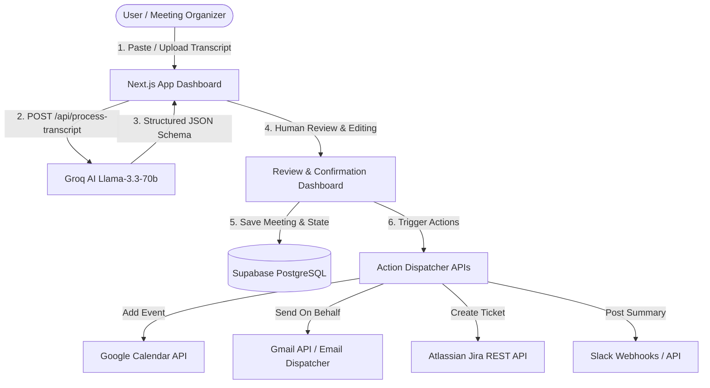

# PID-03: Meeting Decision & Action Tracker — Comprehensive Implementation Plan

## 1. Executive Summary & Architecture Overview

**Goal:** Turn unstructured meeting transcripts (`.txt`, `.vtt`, or pasted text) into validated Decisions, Action Items (Owner + Deadline), Calendar Events, and Jira Tickets using Groq's high-speed AI (`llama-3.3-70b-versatile`), human-in-the-loop review dashboard, Supabase for persistent storage, and NextAuth with Google OAuth + Jira/Slack API integrations.



---

## 2. Database Schema (Supabase / PostgreSQL)

The schema supports multi-tenant users, meeting history, extracted decisions, action items with multi-tool synchronization tracking, and integration credentials.

```sql
-- 1. Users & Accounts (Compatible with NextAuth / Supabase Auth)
CREATE TABLE IF NOT EXISTS users (
    id UUID PRIMARY KEY DEFAULT gen_random_uuid(),
    name TEXT,
    email TEXT UNIQUE NOT NULL,
    image TEXT,
    created_at TIMESTAMP WITH TIME ZONE DEFAULT timezone('utc'::text, now()) NOT NULL
);

-- 2. Meetings Archive
CREATE TABLE IF NOT EXISTS meetings (
    id UUID PRIMARY KEY DEFAULT gen_random_uuid(),
    user_id TEXT NOT NULL,
    title TEXT NOT NULL,
    meeting_date TIMESTAMP WITH TIME ZONE DEFAULT timezone('utc'::text, now()) NOT NULL,
    raw_transcript TEXT NOT NULL,
    summary TEXT,
    key_topics JSONB DEFAULT '[]'::jsonb,
    created_at TIMESTAMP WITH TIME ZONE DEFAULT timezone('utc'::text, now()) NOT NULL
);

-- 3. Extracted Decisions
CREATE TABLE IF NOT EXISTS decisions (
    id UUID PRIMARY KEY DEFAULT gen_random_uuid(),
    meeting_id UUID REFERENCES meetings(id) ON DELETE CASCADE,
    decision_text TEXT NOT NULL,
    category TEXT DEFAULT 'General',
    rationale TEXT,
    source_quote TEXT,
    status TEXT DEFAULT 'approved', -- approved, rejected, modified
    created_at TIMESTAMP WITH TIME ZONE DEFAULT timezone('utc'::text, now()) NOT NULL
);

-- 4. Extracted Action Items
CREATE TABLE IF NOT EXISTS action_items (
    id UUID PRIMARY KEY DEFAULT gen_random_uuid(),
    meeting_id UUID REFERENCES meetings(id) ON DELETE CASCADE,
    task TEXT NOT NULL,
    owner_name TEXT NOT NULL,
    owner_email TEXT,
    deadline TIMESTAMP WITH TIME ZONE,
    priority TEXT DEFAULT 'Medium', -- High, Medium, Low
    category TEXT DEFAULT 'Engineering',
    source_quote TEXT,
    status TEXT DEFAULT 'pending', -- pending, in_progress, completed, rejected
    synced_tools JSONB DEFAULT '{
        "calendar": {"synced": false, "event_id": null, "synced_at": null},
        "jira": {"synced": false, "issue_key": null, "synced_at": null},
        "slack": {"synced": false, "message_ts": null, "synced_at": null},
        "email": {"synced": false, "sent_at": null}
    }'::jsonb,
    created_at TIMESTAMP WITH TIME ZONE DEFAULT timezone('utc'::text, now()) NOT NULL
);

-- 5. User Tool Integrations & OAuth Tokens
CREATE TABLE IF NOT EXISTS user_integrations (
    id UUID PRIMARY KEY DEFAULT gen_random_uuid(),
    user_id TEXT NOT NULL,
    provider TEXT NOT NULL, -- 'google', 'jira', 'slack'
    access_token TEXT,
    refresh_token TEXT,
    token_expiry TIMESTAMP WITH TIME ZONE,
    config JSONB DEFAULT '{}'::jsonb, -- e.g., jira_domain, default_project, slack_channel
    updated_at TIMESTAMP WITH TIME ZONE DEFAULT timezone('utc'::text, now()) NOT NULL,
    UNIQUE(user_id, provider)
);

-- 6. Indexes for High Performance Search
CREATE INDEX IF NOT EXISTS idx_meetings_user_id ON meetings(user_id);
CREATE INDEX IF NOT EXISTS idx_action_items_meeting_id ON action_items(meeting_id);
CREATE INDEX IF NOT EXISTS idx_decisions_meeting_id ON decisions(meeting_id);
CREATE INDEX IF NOT EXISTS idx_action_items_owner ON action_items(owner_name);
```

---

## 3. Groq AI Extraction Pipeline

### Model & Configuration
- **Model:** `llama-3.3-70b-versatile`
- **Response Format:** `{ "type": "json_object" }`
- **Temperature:** `0.1` (Strict deterministic extraction)

### Structured Prompt & Output Schema
```json
{
  "title": "Weekly Sprint Planning & Architecture Sync",
  "summary": "The team agreed on migrating auth to OAuth2 with NextAuth and pushing the v2 beta release to Nov 15th.",
  "key_topics": ["Auth Architecture", "Database Migrations", "Sprint Schedule"],
  "decisions": [
    {
      "decision_text": "Adopt NextAuth v5 with Google OAuth for unified single sign-on",
      "category": "Architecture",
      "rationale": "Reduces maintenance burden and enables direct Google Calendar/Gmail integration",
      "source_quote": "Let's definitely go with NextAuth v5 so we can get Google scopes for calendar and email in one go."
    }
  ],
  "action_items": [
    {
      "task": "Implement Google Calendar API dispatcher with refresh token fallback",
      "owner_name": "Priya",
      "owner_email": "priya@company.com",
      "deadline": "2026-10-02T18:00:00Z",
      "priority": "High",
      "category": "Backend",
      "source_quote": "Priya, can you handle the Google Calendar API sync by next Friday?"
    }
  ]
}
```

---

## 4. API Endpoints Contract

| Endpoint | Method | Purpose | Input / Output |
| :--- | :--- | :--- | :--- |
| `/api/process-transcript` | `POST` | Groq AI transcript parsing | `{ transcript: string, title?: string }` $\rightarrow$ `{ meeting, decisions, action_items }` |
| `/api/meetings` | `GET / POST` | CRUD for meetings | List past meetings / save processed meeting |
| `/api/meetings/[id]` | `GET / DELETE`| Get specific meeting & items | Detailed view with decisions, action items, transcript |
| `/api/actions/calendar` | `POST` | Create Google Calendar Event | `{ actionItemId, title, description, start_time, end_time, attendees }` |
| `/api/actions/jira` | `POST` | Create Jira Issue | `{ actionItemId, summary, description, issueType, priority, dueDate }` |
| `/api/actions/email` | `POST` | Send email notification | `{ actionItemId, to, subject, body }` |
| `/api/actions/slack` | `POST` | Post action item / meeting summary | `{ channel, text, blocks }` |
| `/api/integrations` | `GET / POST` | Manage OAuth & API configs | Store Jira API tokens, Slack Webhooks, Google status |

---

## 5. UI/UX Component Blueprint

### 1. Header & Quick Tool Connection Bar
- User Profile + NextAuth status.
- Integration Badges: 🟢 Google Connected, 🟢 Jira Connected, 🟢 Slack Connected (with one-click connection modals).

### 2. Transcript Input Zone
- Tab 1: **Paste Text** (with character/word counter and quick clear).
- Tab 2: **File Upload** (`.txt`, `.vtt`, `.srt` transcript files with automatic file parsing).
- Tab 3: **Sample Transcripts Picker** (Sprint Planning, Executive Roadmap, Product Sync for 1-click testing).
- Big CTA: *"⚡ Analyze Transcript with Groq"* (with real-time processing indicator).

### 3. Human-in-the-Loop Review Dashboard
- **Meeting Summary & Key Themes** pills.
- **Decisions Grid:** Cards with category badges, editable decision text, and expandable source transcript quotes.
- **Action Items Workspace:**
  - Card view with editable task title, assigned owner (with email auto-suggest), priority dropdown, deadline date-time picker.
  - Action Trigger Toolbar on each card:
    - 📅 **Add to Calendar** (syncs directly to Google Calendar, turns into green synced badge)
    - 🎫 **Create Jira Ticket** (creates ticket, shows clickable Jira ticket ID e.g. `PROJ-104`)
    - ✉️ **Email Owner** (sends formatted task assignment email)
    - 💬 **Post to Slack** (sends interactive card to Slack channel)
  - Bulk Actions: *"Approve & Sync All to Calendar"*, *"Export Meeting Minutes (PDF/Markdown)"*.

### 4. Searchable History & Archive
- Global search bar: live search across transcript texts, decision notes, and action owners.
- Filters: Date, Assignee, Priority, Tool Sync Status.
- Click any item to view the exact **Source Transcript Excerpt** in side drawer.

---

## 6. Execution Roadmap & Timeline (Under 1 Hour)

```
[00:00 - 00:10] Phase 1: Install packages, configure Supabase client, NextAuth Google OAuth, and types.
[00:10 - 00:25] Phase 2: Implement Groq AI transcript extraction pipeline with strict schema validation.
[00:25 - 00:40] Phase 3: Build Action Dispatcher APIs (Google Calendar, Jira, Gmail/Email, Slack).
[00:40 - 00:55] Phase 4: Build modern UI (Transcript Uploader, Interactive Review Cards, Searchable Archive).
[00:55 - 01:00] Phase 5: End-to-end integration test with sample transcripts and live action triggers.
```

---

## 7. Configuration Variables Checklist (`.env.local`)

```env
# NextAuth
AUTH_SECRET="super-secret-random-key"
NEXTAUTH_URL="http://localhost:3000"

# Google OAuth (with Calendar & Gmail scopes)
GOOGLE_CLIENT_ID="your-google-client-id"
GOOGLE_CLIENT_SECRET="your-google-client-secret"

# Groq AI
GROQ_API_KEY="gsk_..."

# Supabase
NEXT_PUBLIC_SUPABASE_URL="https://your-supabase-url.supabase.co"
NEXT_PUBLIC_SUPABASE_ANON_KEY="your-anon-key"
SUPABASE_SERVICE_ROLE_KEY="your-service-role-key"

# Integrations (Optional / Fallback)
JIRA_HOST="https://your-domain.atlassian.net"
JIRA_EMAIL="your-email@domain.com"
JIRA_API_TOKEN="your-token"
SLACK_WEBHOOK_URL="https://hooks.slack.com/services/..."
```
